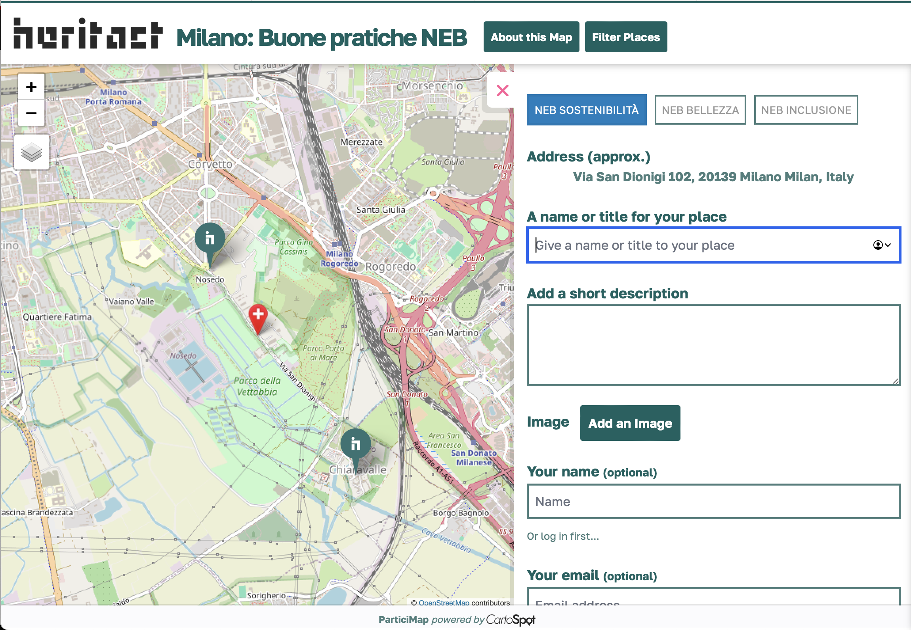
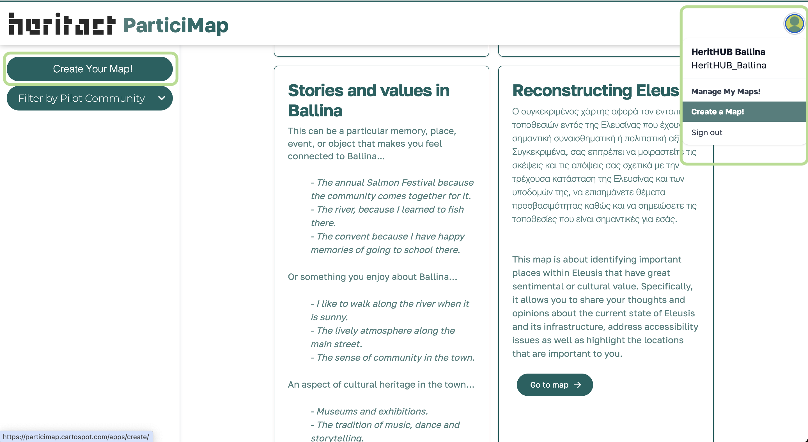
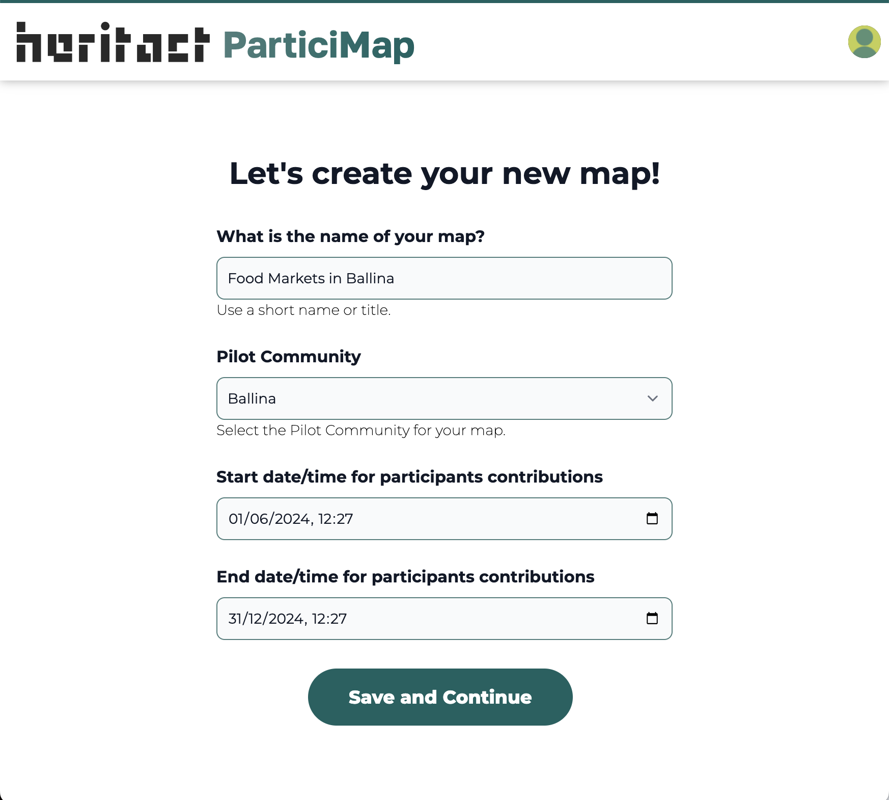
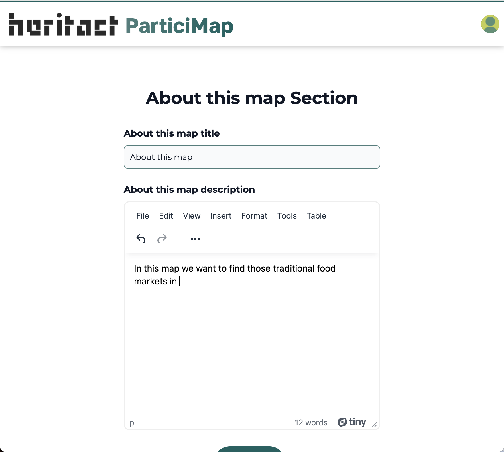
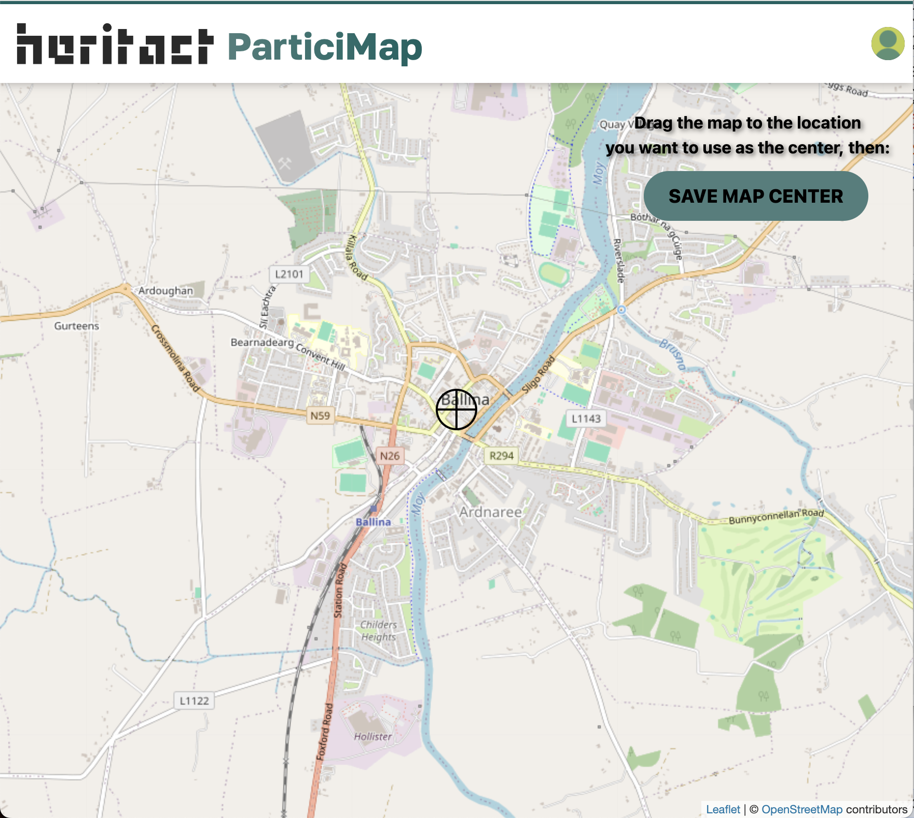
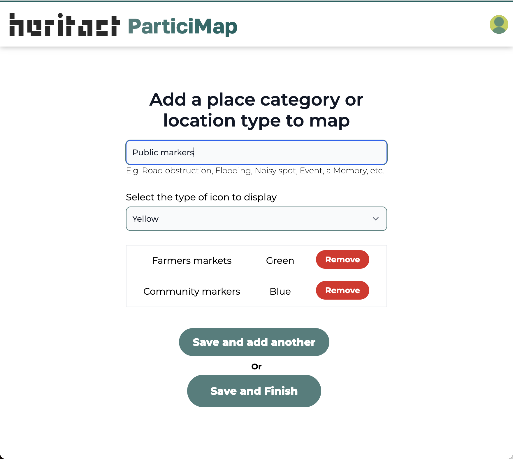
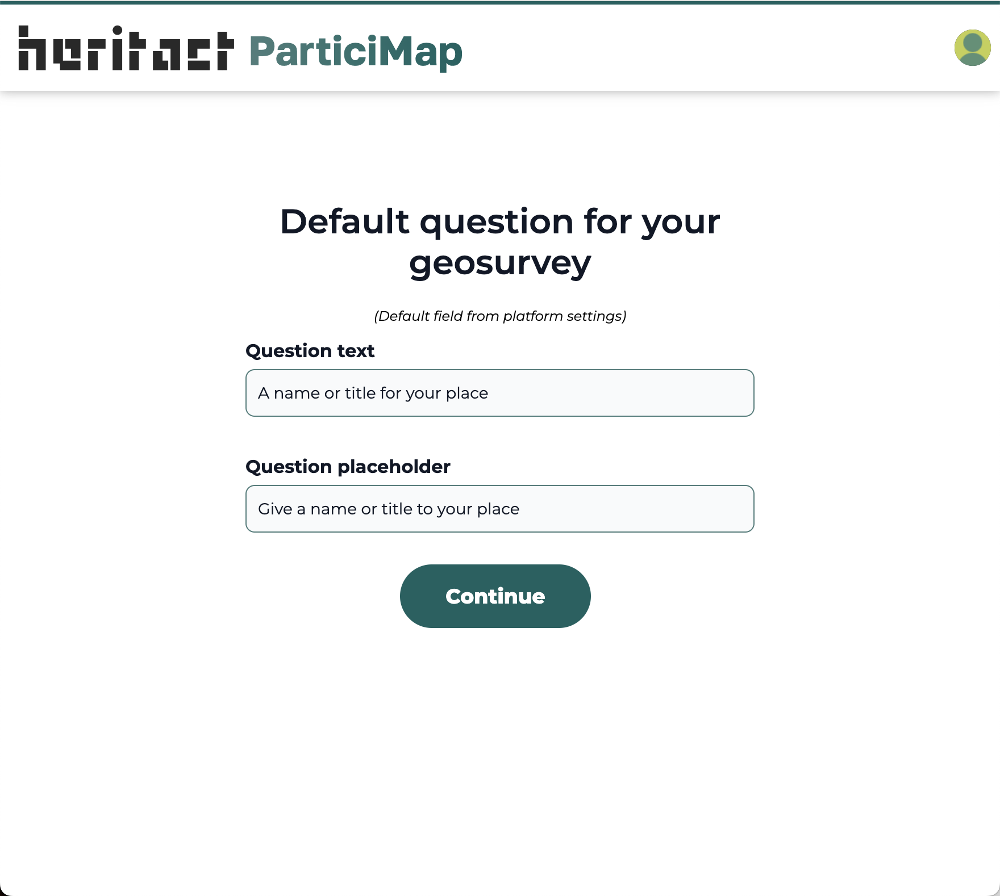
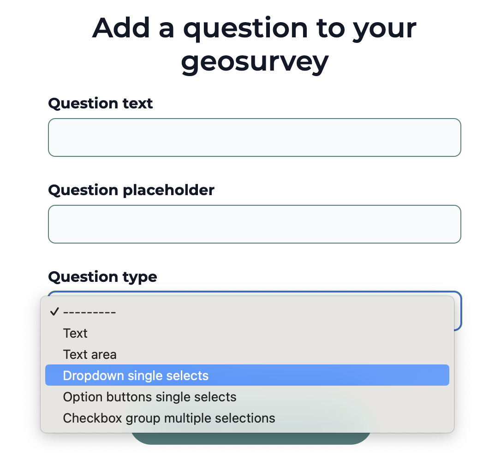
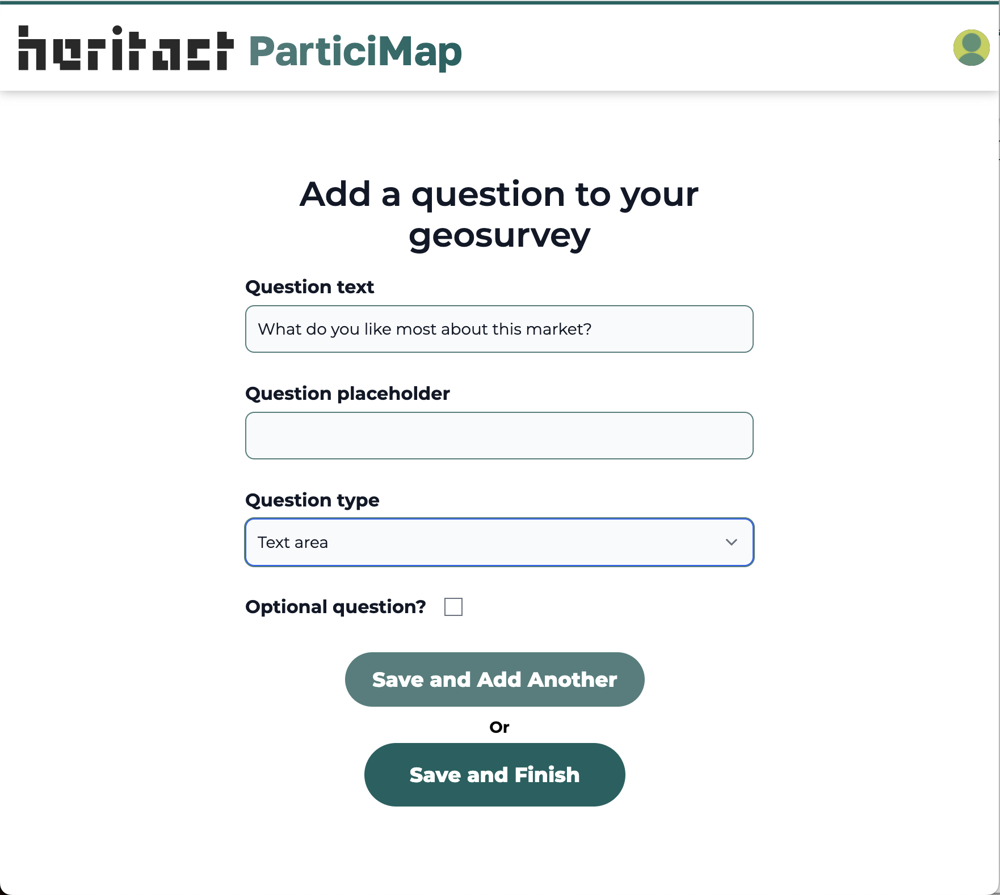
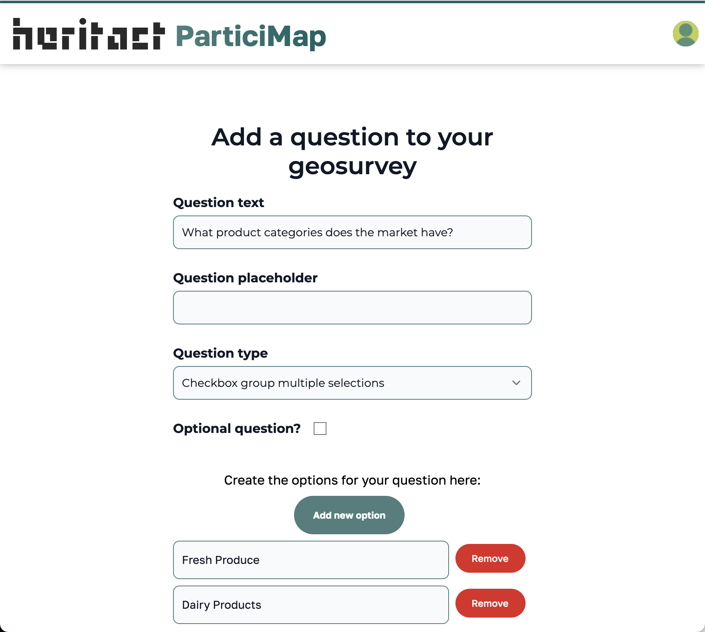

# ParticiMap Tool: User Manual
---

Through Maps and Places local communities and stakeholders can actively improve their dialogue to enhance the cultural heritage of their cities while engaging in participatory mapping activies.

## How to explore Maps?

The ParticiMap tool facilitates geographic surveys to collect Places using a Map as the main interface. To explore the Maps created by the community in the plaform follow these steps:

1. Navigate to the Maps section at [https://particimap.cartospot.com/maps/](https://particimap.cartospot.com/maps/).
2. In this section, you will find all available Maps. 
3. Use the sidebar functionality —**Filter by Pilot Community**— to select Maps from "Elfsina," "Balina," or "Milano."
4. Each Map is displayed as a card with information and a button to view the selected Map.

## Mapping a new Place: How can I contribute to a Map?

To contribute a new Place to a Map, follow these steps:

1. Navigate to the desired Map.
2. Click the **ADD A PLACE** button.
3. This action will show:
   * A red marker with a '+' sign on the basemap indicating where your new Place will be geolocated.
   * The Map's geosurvey, which contains a set of questions for you to submit data and an image or photo using your mobile phone’s camera. This information will be associated with the Place on the Map.

**Anyone can contribute to a Map.** Participants can submit data as anonymous users where entering a name and email is optional, but also it is possible to [sign up](https://particimap.cartospot.com/user/signup/) to contribute with a personal account.

**When setting the Place geographic position:**

* Zoom in and drag the basemap to set the correct position for the Place.
* The geosurvey will also display an approximate geocoded Address that is automatically generated.
* This address is submitted as a complementary reference to the precise geographic coordinates of the Place.

## How to create a Map and design a Geosurvey for  data collection?

### **Creating a New Map.**

Only authenticated users can create Maps. Therefore, you need to create an account and log in first. Follow these steps to create a new Map:

1. **Navigate to the Maps section**: Go to the [Maps section](https://particimap.cartospot.com/maps/).

2. **Create an account and log In**: If you don't have an account, click on the **Login In** button and complete the registration form in [Create an account here!](https://particimap.cartospot.com/user/signup/) If you already have an account, just enter your credentials.

4. **Click on —Create Your Map—**: 
   - In the Maps section, you will find a **Create Your Map** button. Click on this button to start the Map creation process.
   - Alternatively, you can find the **Create a Map** button in the navbar menu under your avatar image.

   

4. **Follow the Steps**: The Map creation process is guided through a series of steps. Follow these steps to complete the setup of your new Map.

   **Note**: Currently, only the "Standard" map creation process is available.

### **Following the Map Creation Process**

1. **Name Your Map**:
   - Provide a name for your Map.
   - Select the name of your community from the dropdown.
   - Set the start and end dates and hours during which your Map will be open to receive contributions from the community.
   - Click the **Save and Continue** button to proceed.
   
   

2. **Update the "About this Map" Section**:
   - Add a title and a short description of your Map.
   - Use the online rich-text editor to style the content as desired.
   - Click the **Save** button to continue.
   
   

3. **Center Your Map**:
   - Drag the map to position the crosshair at the desired location.
   - Click the **Save Map Center** button to continue.
   
   

4. **Add Place Categories**:
   - Define the types of locations your community will categorize on your Map.
   - These categories are also used for filtering Places.
   - Enter the name of each Place category (e.g., Public markers) and select an icon from the dropdown.
   - Click **Save and Add Another** for each category you want to include.
   - When adding the last category, click **Save and Finish** to continue.
   
   

5. **Design Your Geosurvey**:
   - Add questions or data inputs for your Geosurvey. These questions will be associated with each Place and displayed in a form for data collection.
   - The ParticiMap tool includes a default question to collect the name of each Place. You will see this default setting initially.
   - Click **Continue** to start designing your own questions or data inputs.
   
   

   **Creating Questions and Data Inputs**:
   - First, write the text for your question or data input.
   - Optionally, add a placeholder for the question.
   - Select the type of question or data input from the following options:
     - **Text**
     - **Text area**
     - **Dropdown (single select)**
     - **Option buttons (single select)**
     - **Check group (multiple selections)**
     
   

   **Examples**:
   - For dropdowns, option buttons, or check groups, enter a list of options.
   
   
   

   - Click **Save and Add Another** for each question you want to add to your Geosurvey.
   - When adding the last question, click **Save and Finish** to complete the process.

